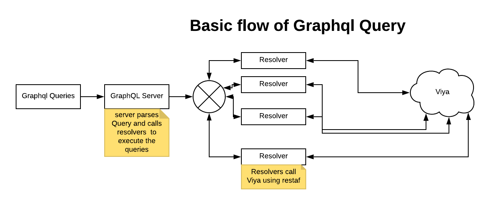

# restaf-graphql-demo

graphql-restaf-demo  is a collection of graphql queries for SAS Viya. This repository provides a few starter examples and reusable code for writing your own resolvers.

1. "stored process" scenario - end-user enters values in a web app and the values are pre-pended to sas code as macros. A REST call is made to the compute service using restaf. Based on the query definition different information is returned.

2. "casl programs" scenario - end-user enters values in a web app and the values are pre-pended as casl assignment statement. A REST call is made to CAS using restaf. Based on the query definition different information is returned.

3. "VA report" scenario - end users can query for existing reports and get either images or url for the report(s).

The basic flow is as follows:



---

## Queries in this demo

---

1. test: Returns a string - sort of "Are you There" test

2. reports: Get list of reports, images and report url for selected reports

3. loanScore:  An example of scoring using a CAS scoring action

4. The following examples use the compute service:

    1. sasPrint - returns ODS output from a proc print of specified table

    2. budget  - returns values of a fake budget program

    3. wineProduction - returns data and/or ODS output from a query on wine production

## Passing queries to the sas or casl programs

The queries for a casl program are prepended to the casl code as \_arg\_ dictionary variable.

The queries for a compute service program are prepended as macro variables.

---

## Organization of the repository

---

## Graphql related code

- src/schema  - for graphql schemas used in this demo

- src/resolvers - resolvers associated with the schema

- src/lib - utility functions that are designed for reuse with schemas users might develop

```text
     The graphql schemas in this repository are only samples to demonstrate how easy it is to use them with SAS Viya. I am by no means an expert on writing good grapqhl schemas. Please contribute to the community if you design some cool schemas and resolvers that can be used with SAS Viya
```

## restaf-graphql-server related code

- ./app.js - used to start the application server. Also used to specify user-defined routes

- ./app.env - configuration for the application.

## Key Dependencies

 -[restaf-graphql-server](https://github.com/sassoftware/restaf-graphql-server) - the graphql server customized for access to SAS Viya

 -[restaf](https://github.com/sassoftware/restaf) - note that this dependency is resolved when restaf-graphql-server is installed.

## To configure this repository

1. Clone the repo
2. Do an npm install ( this will bring in restaf-graphql-server)
3. Edit test.env

    - Set the VIYA_SERVER to your server
    - Set authorization_code clientid and clientSecret
    - Change the APPPORT if you want to use a different port( default is 5000)

---

## To start the application

---

```script
npm start
```

## Application

In your browser enter

```script
http://localhost:5000

```

You should get a page with a few links.

1. The first link will take you to the graphql playground where you can try the sample queries without worrying about writing code.

2. The other links take you to some simple web applications using graphql.

---

## Future demos

---

1. Example of mutation
2. Example of subscription
